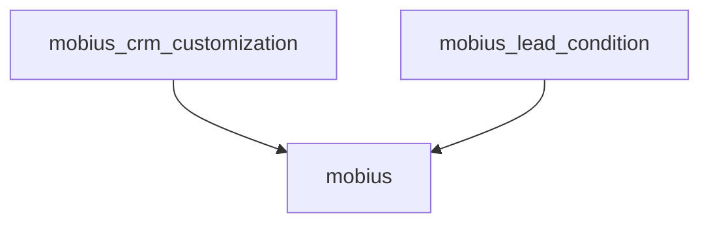

# Інструкція по використанню скриптів аналізу модулів

## Огляд

Для аналізу кастомних модулів перед встановленням в Odoo 18 створено два скрипти:

| Скрипт | Де запускати | Потрібна БД |
|--------|--------------|-------------|
| `analyze_modules.sh` | На сервері | Так |
| `analyze_code_local.sh` | Локально | Ні |

---

## 1. analyze_modules.sh (Серверний скрипт)

### Призначення
Повний аналіз модулів з доступом до PostgreSQL бази даних Odoo.

### Функціонал
- Перевірка стану модуля в базі даних (`installed` / `uninstalled` / `to upgrade`)
- Підрахунок записів у таблицях, створених модулем
- Аналіз залежностей між модулями
- Визначення модулів, що залежать від цього модуля
- Визначення коробкових замін в Odoo 18
- Перевірка deprecated коду (`@api.multi`, `@api.one`, `<tree>`, тощо)
- Генерація детального звіту у форматі Markdown

### Налаштування підключення до БД

**ВАЖЛИВО:** Перед запуском скрипта необхідно змінити параметри підключення до бази даних.

Відкрийте файл `scripts/analyze_modules.sh` та знайдіть секцію PostgreSQL (рядки 30-35):

```bash
# PostgreSQL - ЗМІНІТЬ ЦІ ПАРАМЕТРИ!
DB_HOST="localhost"       # Хост бази даних
DB_PORT="5433"           # Порт PostgreSQL
DB_USER="odoo"           # Користувач БД
DB_NAME="odoo18"         # Назва бази даних
export PGPASSWORD="odoo" # Пароль користувача БД
```

Замініть значення на актуальні для вашого сервера:

| Параметр | Опис | Приклад |
|----------|------|---------|
| `DB_HOST` | IP або hostname сервера БД | `localhost`, `192.168.1.100` |
| `DB_PORT` | Порт PostgreSQL | `5432` (стандартний), `5433` |
| `DB_USER` | Користувач бази даних | `odoo`, `postgres` |
| `DB_NAME` | Назва бази даних Odoo | `odoo18`, `production_db` |
| `PGPASSWORD` | Пароль користувача | `your_secure_password` |

### Додаткові налаштування шляхів

Також перевірте шляхи до директорій (рядки 21-28):

```bash
# Конфігурація - ПЕРЕВІРТЕ ЦІ ШЛЯХИ!
ODOO_DIR="/www/wwwroot/odoo18-migration"
CUSTOM_ADDONS_DIR="${ODOO_DIR}/custom_addons"
ODOO_ADDONS_DIR="${ODOO_DIR}/odoo/addons"
CONFIG_FILE="${ODOO_DIR}/odoo18.conf"
LOG_DIR="${ODOO_DIR}/logs"
```

### Запуск

```bash
# Перейти в директорію з модулями
cd /www/wwwroot/odoo18-migration/custom_addons

# Дати права на виконання
chmod +x scripts/analyze_modules.sh

# Запустити скрипт
./scripts/analyze_modules.sh
```

### Результат

Скрипт створить файли у директорії `logs/`:
- `module_analysis_YYYYMMDD_HHMMSS.log` - детальний лог
- `module_summary_YYYYMMDD_HHMMSS.md` - Markdown звіт

---

## 2. analyze_code_local.sh (Локальний скрипт)

### Призначення
Швидкий аналіз коду модулів без підключення до бази даних. Можна запускати на локальній машині.

### Функціонал
- Аналіз `__manifest__.py` (версія, залежності, автор)
- Підрахунок Python файлів та рядків коду
- Аналіз ORM моделей, контролерів, wizards
- Аналіз XML файлів (views, actions, menus, security rules)
- Перевірка JavaScript компонентів
- Виявлення legacy `odoo.define()` коду
- Генерація Mermaid графу залежностей
- Рекомендації щодо порядку встановлення

### Налаштування

Скрипт автоматично визначає директорію проекту. Додаткові налаштування не потрібні.

### Запуск

```bash
# Перейти в кореневу директорію проекту
cd /media/yurii/Data\ 1/PhpStormProjects/Odoo-Modules-Update

# АБО на сервері
cd /www/wwwroot/odoo18-migration/custom_addons

# Дати права на виконання
chmod +x scripts/analyze_code_local.sh

# Запустити скрипт
./scripts/analyze_code_local.sh
```

### Результат

Скрипт створить файл у кореневій директорії:
- `analysis_report_YYYYMMDD_HHMMSS.md` - Markdown звіт з Mermaid діаграмою

---

## Приклад звіту

### Серверний скрипт (analyze_modules.sh)

```markdown
# Звіт аналізу модулів Odoo 18

## mobius_lead_condition

| Параметр | Значення |
|----------|----------|
| Стан в БД | installed |
| Записів у таблицях | 150 |
| Залежності | crm, sale |
| Залежні модулі | mobius_crm_customization |
| Коробкова заміна | Ні |

### Deprecated код:
- `<tree>` знайдено в 2 файлах
```

### Локальний скрипт (analyze_code_local.sh)

```markdown
# Звіт аналізу модулів Odoo

## mobius_lead_condition

- Версія: `15.0.0.0.5`
- Залежності: `crm, sale`
- Python: 5 файлів, 320 рядків
- XML: 3 файлів, 2 views, 1 меню
- **Важливість: MEDIUM**

## Граф залежностей кастомних модулів



---

## Коробкові заміни в Odoo 18

Скрипти автоматично визначають модулі, які мають вбудовані аналоги в Odoo 18:

| Модуль | Заміна в Odoo 18 |
|--------|------------------|
| `base_account_budget` | `account_budget` (Enterprise) |
| `account_dynamic_reports` | Вбудовані динамічні звіти в Accounting |
| `base_accounting_kit` | Стандартний Accounting модуль |
| `crm_facebook_leads` | Social Marketing (Enterprise) або OCA/crm-addons |
| `openapi` | Вбудований REST API (Odoo 17+) |
| `base_api` | JSON-RPC та новий REST API |
| `mail_debrand` | System Parameters: `mail.catchall.domain`, `web.base.url` |
| `barcodes_generator_abstract` | Покращений barcode модуль |
| `account_netting` | OCA/account-financial-tools для v18 |
| `l10n_ua` | OCA/l10n-ukraine (перевірити наявність для v18) |

---

## Troubleshooting

### Помилка підключення до БД

```
psql: error: connection to server failed
```

**Рішення:**
1. Перевірте, чи PostgreSQL запущений: `systemctl status postgresql`
2. Перевірте порт: `netstat -tlnp | grep postgres`
3. Перевірте параметри `DB_HOST`, `DB_PORT`, `DB_USER`, `PGPASSWORD`

### Помилка "Permission denied"

```
bash: ./scripts/analyze_modules.sh: Permission denied
```

**Рішення:**
```bash
chmod +x scripts/analyze_modules.sh
chmod +x scripts/analyze_code_local.sh
```

### Скрипт не знаходить модулі

```
Модулів не знайдено
```

**Рішення:**
- Переконайтеся, що запускаєте скрипт з кореневої директорії проекту
- Перевірте, що модулі мають файл `__manifest__.py`

---

## Рекомендації

1. **Спочатку запустіть локальний скрипт** для швидкого огляду коду
2. **Потім запустіть серверний скрипт** для аналізу даних в БД
3. **Звіти використовуйте** для планування порядку встановлення модулів
4. **Модулі з коробковою заміною** розгляньте на предмет видалення
5. **Модулі без записів у БД** можливо ніколи не використовувались

---

**Останнє оновлення:** 2024-12-18
